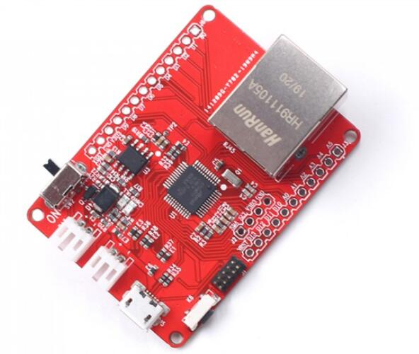

# Maduino Zero Ethernet

```c++
/*
Version:		V1.0
Author:			Vincent
Create Date:	2022/12/30
Note:
	
*/
```



[toc]

# Makerfabs

[Makerfabs home page](https://www.makerfabs.com/)

[Makerfabs Wiki](https://wiki.makerfabs.com/)

# Maduino Zero Ethernet
## Intruduce

Product Link ：[Maduino Zero Ethernet](https://www.makerfabs.com/maduino-zero-ethernet.html) 

Wiki Link : [Maduino Zreo Ethernet](https://wiki.makerfabs.com/Maduino_Zreo_Ethernet.html) 

This Maduino Zero Ethernet lets you add quick and easy wired Internet. Just plug in a standard Ethernet cable, the WIZ5500 chip communicates over SPI plus a single CS pin to the Maduino zero controller ATSAMD21G18. As a nice extra, the RJ-45 jack has both link and activity lights that will light/blink to let you know the current connection status.


## Feature

- Arduino compatible
- ATSAMD21G18, 32-Bit ARM Cortex M0+
- Size: 40*55mm
- Support Micro SD Card
- 18* GPIO


# Code

## Compiler Options

**If you have any questions，such as how to install the development board, how to download the code, how to install the library. Please refer to :[Makerfabs_FAQ](https://github.com/Makerfabs/Makerfabs_FAQ)**

- Install board : **Arduino Zero**.
- Upload codes, select **Arduino/Genuino Zero(Native USB port)** 